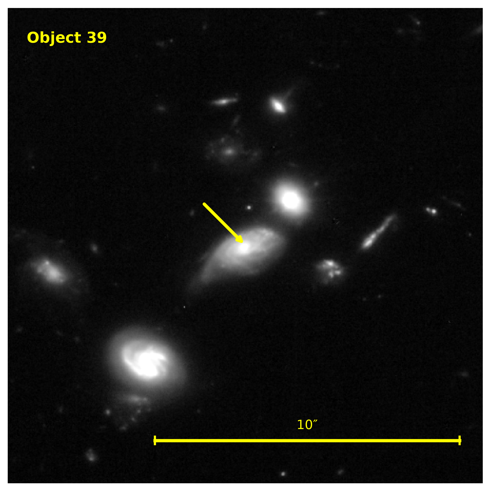

# C19 — ASPECS 1.2 mm Continuum Source

**ASPECS ID:** C19

**Status:** Active dossier

**Last Updated:** 2026-07-31

---

# Executive Summary

C19 is a millimeter continuum source detected in the ALMA Spectroscopic Survey in the Hubble Ultra Deep Field (ASPECS).

It belongs to the primary 1.2 mm continuum sample presented by Aravena et al. and has an associated optical/near-infrared counterpart. The galaxy is detected at high significance in the ALMA continuum and has an identified CO counterpart.

Current evidence indicates that C19 is a moderately massive star-forming galaxy at redshift z = 2.574 containing substantial molecular gas and dust.

This dossier assembles all published information concerning C19 into a single, traceable scientific record.

---

# Cover Image

**Figure 1.** Current JWST NIRCam cutout containing the published position of ASPECS C19. The arrow indicates the candidate counterpart. The identification will be confirmed through astrometric matching.

*Status:* Candidate cover image.

The precise optical/near-infrared counterpart will be confirmed through
astrometric matching between the published ASPECS coordinates and the
Galaxy Explorer object catalogue. Once verified, this image will be
updated with a centered cutout and annotation identifying C19.

Image source:
JWST NIRCam (F200W)

---

## Scientific Record

**Canonical Object Name:** ASPECS C19

**First Detection Paper:**
Aravena et al. (2019)
The Nature of the Faintest Dusty Star-forming Galaxies

**Current Dossier Version:** 0.1

**Confidence Level:** Literature Only

**Primary References**

1. Aravena et al. 2019
2. Decarli et al. 2019

---

# Basic Identification

| Property | Value |
|----------|-------|
| Object ID | C19 |
| Survey | ASPECS |
| Sample | Primary 1.2 mm continuum sample |
| Detection | ALMA 1.2 mm continuum |
| Optical/NIR counterpart | Yes |
| CO counterpart | CO ID 12 |
| Primary reference | Aravena et al. (2019) |

---

# Coordinates

| Quantity | Value |
|----------|-------|
| Right Ascension (J2000) | 03:32:36.19 |
| Declination (J2000) | −27:46:28.0 |

---

# Physical Properties Snapshot

## Observed Quantities

| Property | Value | Source |
|----------|-------|--------|
| Redshift | 2.574 | Aravena et al. (2019), Table 2 |
| m160 | 23.1 AB | Aravena et al. (2019), Table 2 |
| S1.2mm | 85 ± 12 μJy | Aravena et al. (2019), Tables 1 & 2 |
| S3mm | <20 μJy | Aravena et al. (2019), Table 1 |

## Derived Quantities

| Property | Value | Source |
|----------|-------|--------|
| Stellar Mass | 4.4 × 10¹⁰ M☉ | Aravena et al. (2019), Table 2 |
| Star Formation Rate | 34 M☉ yr⁻¹ | Aravena et al. (2019), Table 2 |
| Dust Temperature | 51 K | Aravena et al. (2019), Table 2 |
| Infrared Luminosity | 4.1 × 10¹¹ L☉ | Aravena et al. (2019), Table 2 |
| Mₘₒₗ,SED | 0.9 × 10¹⁰ M☉ | Aravena et al. (2019), Table 2 |
| Mₘₒₗ,RJ | 1.1 × 10¹⁰ M☉ | Aravena et al. (2019), Table 2 |
| Mₘₒₗ,CO | 1.8 × 10¹⁰ M☉ | Aravena et al. (2019), Table 2 |

---

# Survey Detections

C19 has been observed through multiple surveys spanning the
millimetre, optical, and near-infrared regimes. Together these
observations provide a coherent view of the galaxy's stellar,
dust, and molecular gas components.

| Survey | Detection | Evidence |
|----------|-----------|----------|
| ASPECS LP 1.2 mm | ✓ | Blind ALMA continuum detection |
| ASPECS Band 3 | ✓ | CO source ID 12 |
| HST | ✓ | Optical/NIR counterpart |
| MUSE | ✓ | Spectroscopic confirmation |
| JWST NIRCam | ✓ | Candidate counterpart identified |
| Herschel PACS | Likely | Included in SED fitting |
| Spitzer IRAC/MIPS | Used | Included in SED fitting |

---

## ALMA Spectroscopic Survey (ASPECS)

The first published detection of C19 was made during the ALMA
Spectroscopic Survey (ASPECS) Large Program in the Hubble Ultra Deep
Field. C19 was identified as a significant 1.2 mm continuum source and
included in the primary continuum sample presented by Aravena et al.
(2019).

| Property | Value |
|----------|-------|
| Observatory | ALMA |
| Survey | ASPECS Large Program |
| Detection Type | 1.2 mm Continuum |
| Detection Significance | 6.8σ |
| Continuum Flux Density | 85 ± 12 μJy |
| Associated CO Source | CO ID 12 |
| Reference | Aravena et al. (2019) |

Scientific Contribution

The ALMA detection established C19 as a dusty star-forming galaxy during
Cosmic Noon and identified it as a target for subsequent analyses of
dust, molecular gas, and galaxy evolution.

---

## Hubble Space Telescope

Optical and near-infrared imaging from the Hubble Ultra Deep Field
provided the counterpart used for multi-wavelength analysis. These data
formed the basis for deriving stellar masses, infrared luminosities, and
other physical properties presented by Aravena et al. (2019).

Reference

Aravena et al. (2019)

Scientific Contribution

Hubble imaging linked the millimetre detection to its optical galaxy,
enabling a comprehensive physical characterization of C19.

---

## James Webb Space Telescope (JWST)

Deep JWST NIRCam observations include the published position of C19.
Current work within the Cosmic Intelligence Lab is verifying the
precise optical counterpart through astrometric comparison between the
published ASPECS coordinates and the Galaxy Explorer catalogue.

Current Status

- JWST NIRCam imaging available
- Candidate counterpart identified
- Astrometric confirmation in progress

Scientific Contribution

JWST provides significantly higher sensitivity and spatial resolution
than previous observations and will support future studies of the
galaxy's morphology and stellar structure.

Reference

Cosmic Intelligence Lab (Galaxy Explorer analysis)

---

# Cross Identifications

C19 appears under different identifiers in several astronomical
catalogues. Maintaining these cross-identifications is essential for
combining information from multiple surveys and publications.

| Catalogue / Resource | Identifier | Status | Notes |
|----------------------|------------|--------|-------|
| ASPECS | C19 | Confirmed | Primary 1.2 mm continuum identifier |
| ASPECS CO Catalogue | CO ID 12 | Confirmed | Associated CO detection |
| NED | ASPECS-LP.1 mm.Faint.C19 | Confirmed | NED object entry |
| Galaxy Explorer | Object 39 | Pending Verification | Candidate counterpart under astrometric investigation |
| SIMBAD | Pending | Not yet investigated | No confirmed cross-identification |

## Identity Verification

Current confidence: **High**

### Confirmed

- ASPECS continuum identifier (C19)
- Associated CO source (CO ID 12)
- NED object identification

### Pending

- Final astrometric confirmation of Galaxy Explorer Object 39
- SIMBAD cross-identification

---

# Data Products

| Product | Status |
|----------|--------|
| ALMA 1.2 mm continuum | ✓ |
| CO spectrum | ✓ |
| HST imaging | ✓ |
| JWST imaging | ✓ |
| NED object page | ✓ |
| Galaxy Explorer cutout | ✓ |
| SIMBAD entry | Pending |
| MUSE spectrum | Pending |

This section summarizes the observational datasets and external
resources currently incorporated into the C19 dossier.

---

# Observational History

## 2019 — Initial ALMA 1.2 mm Continuum Detection

Reference:
Aravena et al. (2019)

• C19 identified in the primary ASPECS 1.2 mm continuum sample.
• Detected at 6.8σ significance.
• Measured continuum flux:
    S1.2mm = 85 ± 12 μJy
• Optical/NIR counterpart identified.
• Associated with CO source ID 12.

Scientific Contribution

This paper represents the first published identification of C19 as a dusty millimetre-selected galaxy.

---

## 2019 — Physical Properties Derived

Reference:
Aravena et al. (2019)

• Photometric redshift / adopted redshift:
    z = 2.574

• Stellar mass estimated.

• Star-formation rate estimated.

• Infrared luminosity estimated.

• Dust temperature estimated.

• Molecular gas mass estimated from dust continuum.

Scientific Contribution

Established the first physical picture of C19.

---

## 2019 — Molecular Gas Analysis

Reference:
Decarli et al. (2019)

• CO emission analysed.

• Molecular gas mass independently estimated.

• Gas fraction measured.

• Gas depletion time discussed.

Scientific Contribution

Established C19 as one of the faint dusty galaxies identified
during the ASPECS Large Program.

---

## CO Detection

C19 is securely associated with **CO source ID 12** identified in the
ASPECS 3 mm molecular line survey.

The ASPECS CO sample was constructed using blind searches of the
ALMA Band 3 data cube with multiple independent line-search
algorithms. Only highly reliable detections were included in the
primary sample. :contentReference[oaicite:0]{index=0}

---

## Molecular Gas Measurements

| Property | Value | Source |
|----------|-------|--------|
| Associated CO source | CO ID 12 | Aravena et al. (2019) |
| Molecular gas mass (CO) | 1.8 × 10¹⁰ M☉ | Aravena et al. (2019), Table 2 |
| CO-based redshift | 2.574 | Decarli et al. (2019) |

---

## Methodology

The physical properties of C19 were derived using the MAGPHYS
(Multi-wavelength Analysis of Galaxy Physical Properties) fitting
code.

MAGPHYS combines stellar population synthesis models with dust
emission models while enforcing an energy balance between absorbed
stellar light and re-emitted infrared radiation.

For C19, the fitting incorporated photometry spanning the optical,
near-infrared, mid-infrared, far-infrared, and millimetre regimes.

The resulting best-fit model provides estimates of:

- stellar mass
- star-formation rate
- infrared luminosity
- dust temperature
- dust mass
- molecular gas mass (from dust)

---

## Scientific Significance

The CO detection independently confirms that C19 contains a
substantial reservoir of molecular gas capable of sustaining
ongoing star formation.

Together with the dust-continuum measurements, the CO observations
place C19 among the molecular gas-rich galaxies observed during
Cosmic Noon.

## Future Observations

This section will document future observations of C19 as additional
literature becomes available.

No post-2019 observational studies have yet been incorporated into
this dossier.

---

# Dust Continuum

## Overview

C19 was discovered as part of the ALMA Spectroscopic Survey (ASPECS)
Large Program through its 1.2 mm dust continuum emission. The continuum
detection traces thermal radiation from interstellar dust heated
primarily by young stars and provides an important probe of the galaxy's
interstellar medium.

---

## Observations

The continuum emission was measured using deep ALMA Band 6 observations
of the Hubble Ultra Deep Field.

| Quantity | Value | Source |
|----------|-------|--------|
| Detection significance | 6.8σ | Aravena et al. (2019), Table 1 |
| 1.2 mm flux density | 85 ± 12 μJy | Aravena et al. (2019), Tables 1 & 2 |
| 3 mm flux density | <20 μJy | Aravena et al. (2019), Table 1 |

---

## Interpretation

The 1.2 mm continuum emission indicates the presence of cold dust within
C19. Combined with multi-wavelength photometry and SED modelling, these
observations were used to estimate the dust temperature, infrared
luminosity, and molecular gas content reported elsewhere in this
dossier.

---

## Scientific Significance

C19 belongs to the faint population of dusty star-forming galaxies
identified by the ASPECS Large Program. Its detection demonstrates the
ability of deep ALMA observations to uncover galaxies that are much
fainter than the classical submillimetre galaxy population.

---

## References

Aravena et al. (2019)

---

# Stellar Population

SED fitting indicates that C19 is a moderately massive,
actively star-forming galaxy.

Derived stellar properties

| Property | Value |
|----------|-------|
| Redshift | 2.574 |
| Stellar Mass | 4.4 × 10¹⁰ M☉ |
| Star Formation Rate | 34 M☉ yr⁻¹ |

The physical parameters were derived using MAGPHYS,
combining more than twenty optical through millimetre
photometric bands.

The fitting simultaneously constrains the stellar
population, dust attenuation, infrared luminosity,
dust mass, and star-formation rate using energy-balanced
spectral energy distribution modelling.

---

# Morphology

An optical/near-infrared counterpart is securely identified.

Current imaging suggests a resolved galaxy with extended
stellar emission.

A detailed morphological classification awaits analysis
using higher-resolution JWST imaging together with
published astrometric verification.

Status:
Preliminary.

---

# Scientific Interpretation

Current evidence indicates that C19 is representative of the
population of faint dusty star-forming galaxies uncovered by
the ASPECS Large Program.

Unlike the classical bright submillimetre galaxies discovered
in earlier surveys, C19 has a moderate star-formation rate
and stellar mass while still containing a substantial molecular
gas reservoir.

The object therefore contributes to understanding the dominant
population of dust-obscured galaxies during Cosmic Noon rather
than the rare extreme starburst population.

---

# Spectral Energy Distribution

C19 was modelled using the MAGPHYS SED fitting framework.

Available photometry includes

- HST
- Spitzer
- Herschel PACS
- ALMA 1.2 mm
- ALMA 3 mm

The fitting provides self-consistent estimates of

- stellar mass
- star-formation rate
- infrared luminosity
- dust mass
- dust temperature
- molecular gas mass (via dust)

These parameters form the basis for the physical
properties listed earlier in this dossier.

---

# Images

This section contains observational imagery associated with C19 collected from astronomical archives and published literature.

Current images

- JWST NIRCam candidate counterpart
- Future HST cutouts
- ALMA continuum images
- Multi-wavelength postage stamps

Status:
Growing archive.

---

# Figures

This section documents figures from the scientific literature that are
directly relevant to C19. Whenever possible, copies of these figures
will be stored in the `figures/` directory while preserving complete
publication provenance.

---

## Published Figures

### Figure 1 — ASPECS Large Program Survey Overview

**Source:**
Aravena et al. (2019)

**Description:**
Survey overview of the Hubble Ultra Deep Field showing the locations of
the ASPECS Large Program continuum detections, including C19.

**Status:**
To be extracted.

---

### Figure 15 — Multi-wavelength Postage Stamps

**Source:**
Aravena et al. (2019), Appendix B

**Description:**
Published image cutouts of C19 showing multiple wavelengths, including:

- HST colour composite
- HST F850LP
- HST F160W
- Spitzer IRAC
- ALMA 1.2 mm continuum

**Status:**
To be extracted.

---

### Figures 16–17 — MAGPHYS Spectral Energy Distribution

**Source:**
Aravena et al. (2019), Appendix C

**Description:**
Observed photometry together with the best-fitting MAGPHYS spectral
energy distribution used to derive the published stellar mass, dust
temperature, infrared luminosity, and star-formation rate of C19.

**Status:**
To be extracted.

---

## Future Figures

Additional published figures will be incorporated as new literature
becomes available.

Potential additions include:

- CO spectra
- Molecular gas maps
- JWST imaging
- ALMA high-resolution observations
- Comparison plots with other ASPECS galaxies

---

# Timeline of Publications

This timeline records the chronological development of scientific
knowledge concerning C19.

2019

- Aravena et al.
  Initial continuum detection and physical characterization.

- Decarli et al.
  CO molecular gas analysis.

Future

Additional publications will be incorporated as they become available.

(To be completed)

---

# Molecular Gas

## Overview

C19 is associated with CO source ID 12 in the ASPECS Large Program
3 mm spectral scan. The CO detection provides an independent probe
of the molecular gas reservoir, complementing the dust-continuum
estimates presented elsewhere in this dossier.

Unlike dust continuum measurements, which infer gas masses through
dust emission models, the CO observations directly trace molecular
gas through rotational transitions of carbon monoxide.

---

# Open Questions

Despite the substantial body of published work, several aspects of C19
remain incompletely understood and represent opportunities for future
investigation.

## Current Research Questions

- Precise confirmation of the JWST optical/near-infrared counterpart through astrometric analysis.
- Detailed morphological classification using high-resolution JWST imaging.
- Evidence for mergers, interactions, or nearby companion galaxies.
- Spatial distribution and extent of the dust continuum emission.
- Molecular gas kinematics from higher-resolution CO observations.
- Possible evidence for active galactic nucleus (AGN) activity.
- Future high-resolution ALMA imaging of the molecular gas and dust.

## Status

**Active areas of investigation.**

These questions will be revisited as new observations and publications
become available.

---

# Counterpart Identification

## Positional Evidence

### Cone Search

A 30 arcsec cone search of the JADES DR5 catalog centered on the
ASPECS C19 position identified **1,471 JADES galaxies** within the
search radius.

The ten nearest JADES sources were selected for detailed counterpart
analysis.

### Nearest JADES Candidate Counterparts

| Rank | JADES ID | Separation (arcsec) | z_peak | Notes |
|-----:|---------:|--------------------:|-------:|-------|
| 1 | 209117 | 0.236 | 3.790 | Closest positional match |
| 2 | 209116 | 1.226 | 2.810 | Closest redshift candidate |
| 3 | 400187 | 1.367 | 3.340 | Nearby source |
| 4 | 400199 | 1.498 | 3.560 | Nearby source |
| 5 | 128606 | 1.649 | 3.430 | Nearby source |
| 6 | 312982 | 1.939 | 3.950 | Nearby source |
| 7 | 400194 | 1.995 | 1.460 | Nearby source |
| 8 | 389334 | 2.118 | 5.040 | Nearby source |
| 9 | 812948 | 2.481 | 6.410 | Nearby source |
| 10 | 265671 | 2.581 | 3.950 | Nearby source |

### Candidate Counterparts

The positional analysis identifies two leading candidate counterparts.

**JADES 209117** is the nearest galaxy to the published ASPECS C19
position, with an angular separation of **0.236 arcsec**. It is therefore
the strongest positional candidate.

**JADES 209116** is the second-nearest galaxy, with an angular separation
of **1.226 arcsec**. Although it is farther from the ALMA position, its
photometric redshift is closer to the published CO redshift, making it
the strongest redshift candidate.

**Figure 4.** JWST NIRCam F200W image centered on ASPECS C19. The red "+"
marks the published ALMA position. Cyan circles identify the ten nearest
JADES galaxies returned by a 30 arcsec cone search. JADES 209117 (gold)
is the closest positional candidate, while JADES 209116 (green) is the
second-closest candidate.

### Positional Assessment

The angular separation strongly favors JADES 209117 as the leading
positional counterpart. Its separation of **0.236 arcsec** places it
very close to the published ASPECS C19 position. JADES 209116 is the
next-nearest candidate at **1.226 arcsec**.

The positional analysis alone does not establish the physical identity
of the CO source. Redshift and morphological evidence are therefore
examined separately below.

### Cone Search

A 30 arcsec cone search of the JADES DR5 catalog around the published
ASPECS C19 position identified **1,471 neighboring galaxies**.

The ten nearest galaxies were selected for detailed analysis.

### Nearest JADES Candidate Counterparts

| Rank | JADES ID | Separation (arcsec) | z_peak | Notes |
|-----:|----------:|--------------------:|-------:|-------|
| 1 | 209117 | 0.236 | 3.790 | Closest positional match |
| 2 | 209116 | 1.226 | 2.810 | Closest redshift candidate |
| 3 | 400187 | 1.367 | 3.340 | Nearby galaxy |
| 4 | 400199 | 1.498 | 3.560 | Nearby galaxy |
| 5 | 128606 | 1.649 | 3.430 | Nearby galaxy |
| 6 | 312982 | 1.939 | 3.950 | Nearby galaxy |
| 7 | 400194 | 1.995 | 1.460 | Foreground candidate |
| 8 | 389334 | 2.118 | 5.040 | Background candidate |
| 9 | 812948 | 2.481 | 6.410 | Background candidate |
|10 | 265671 | 2.581 | 3.950 | Nearby galaxy |

**Figure 4.** JWST NIRCam F200W image centered on ASPECS C19. The red "+" marks the published ALMA position. Cyan circles identify the ten nearest JADES galaxies returned by a 30 arcsec cone search. JADES 209117 (gold) is the closest positional candidate, while JADES 209116 (green) is the second-closest candidate.

### Candidate Counterparts

The positional analysis identifies two leading candidate counterparts.

**JADES 209117** is the nearest galaxy to the published ASPECS C19 position,
with an angular separation of **0.236 arcsec**. It is therefore the strongest
**positional** candidate.

**JADES 209116** is the second-nearest galaxy, with an angular separation of
**1.226 arcsec**. Although it is farther from the ALMA position, its
photometric redshift is closer to the published CO redshift, making it the
strongest **redshift** candidate.

Figure 4 compares the locations of the ten nearest JADES galaxies relative to
the published ALMA position of C19.

---

## Redshift Evidence

---

## Morphological Evidence

---

## Current Assessment

The positional evidence strongly favors JADES 209117 as the optical counterpart to ASPECS C19. However, the photometric redshift of JADES 209116 is closer to the CO redshift measured by ALMA. Additional spectroscopic information or improved photometric constraints would help distinguish between these possibilities.
---

# Einstein Research Notes

Working hypotheses

Current Galaxy Explorer Object 39 is the most likely optical counterpart.

Future tasks

- Verify astrometry.
- Compare JWST morphology with HST.
- Query NED for new publications.
- Search ADS for additional literature.
- Update the dossier as new evidence becomes available.

These notes document ongoing work within the Cosmic Intelligence Lab and
are intentionally separated from the published scientific record.

(To be completed)

---

# References

This dossier is based on peer-reviewed literature, astronomical
archives, and analyses performed within the Cosmic Intelligence Lab.
References are grouped by category to preserve the provenance of all
measurements and interpretations.

---

## Primary Literature

Aravena, M., et al. (2019)

*The Nature of the Faintest Dusty Star-forming Galaxies*

Primary discovery paper describing the ASPECS 1.2 mm continuum sample,
including the initial detection and physical characterization of C19.

---

Decarli, R., et al. (2019)

*Evolution of the Molecular Gas in CO-selected Galaxies from the
ALMA Spectroscopic Survey in the Hubble Ultra Deep Field*

Provides the molecular gas analysis associated with the ASPECS CO
survey, including the CO counterpart linked to C19.

---

González-López, J., et al. (2020)

*The ALMA Spectroscopic Survey in the Hubble Ultra Deep Field:
The ASPECS LP 1.2 mm Continuum Catalogue*

Describes the construction of the complete ASPECS Large Program
1.2 mm continuum catalogue and survey methodology.

---

SIMBAD Astronomical Database

Future source of catalogue cross-identifications.

---

MAST (Mikulski Archive for Space Telescopes)

Source of Hubble and JWST archival observations.

---

ALMA Science Archive

Source of ALMA observational products associated with ASPECS.

---

## Internal Resources

Cosmic Intelligence Lab

Research environment used to organize, analyse, and document
the scientific evidence associated with C19.

---

Galaxy Explorer

Interactive visualization and catalogue exploration tool
developed within the Cosmic Intelligence Lab.

---

## Future Literature

This section will be expanded as additional publications concerning
C19 become available.

## Astronomical Archives

- NASA/IPAC Extragalactic Database (NED)
- SIMBAD Astronomical Database
- MAST Archive
- ALMA Science Archive

## Internal Resources

- Cosmic Intelligence Lab
- Galaxy Explorer

(To be expanded)
